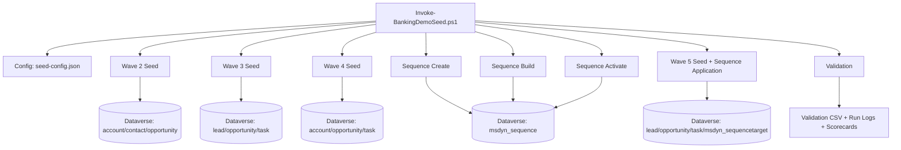

# Dynamics 365 Retail Banking Sales Demo Data

Reusable Dynamics 365 / Dataverse demo seed framework for Retail Banking scenarios.

## What this project does

This project generates realistic banking pipeline data in waves and can also manage Sales Accelerator sequence setup.

- Seeds Retail Banking data across Waves 2–5
- Supports Sales Accelerator sequence create/build/activate
- Applies sequences to target records in Wave 5 (including backfill targets)
- Produces scorecards and validation artifacts per run

Wave 1 is intentionally not part of the automated orchestrator because it was originally designed as a preview/approval-first flow.

## Architecture (Mermaid)



## Records generated (by wave)

### Wave 2 (`seed-retail-wave2.ps1`)
- Creates `account` records (households)
- Links existing `contact` records to those households
- Creates `opportunity` records for branch/product scenarios
- Sets opportunity outcomes (won/lost/open mix)
- Outputs branch KPI summary

### Wave 3 (`seed-retail-wave3.ps1`)
- Creates `lead` records from contact cohort
- Converts a subset into `opportunity` records
- Creates `task` records for next-best-action follow-up
- Outputs manager dashboard extract JSON

### Wave 4 (`seed-retail-wave4.ps1`)
- Creates cross-sell `opportunity` records from retail household accounts
- Tags churn-risk indicators on selected `account` records
- Creates retention + next-best-action `task` records
- Outputs executive scorecards (JSON + CSV)

### Wave 5 (`launch-wave5-with-sequences.ps1`)
- Creates new RM cohort `lead` records
- Creates cohort-linked `opportunity` records
- Creates SLA simulation `task` records (breach/on-track)
- Applies sequence targets using `msdyn_sequencetarget` for `opportunity`, `lead`, and `contact`
- Outputs Wave 5 scorecard + sequence summary CSV

### Sequence scripts
- `create-sales-accelerator-sequences-wave1-4.ps1`
- `build-sales-accelerator-sequences-wave1-4.ps1`
- `activate-sales-sequences-wave1-4.ps1`

## Orchestrator (V1)

Primary entrypoint:

- `v1-seed-framework/Invoke-BankingDemoSeed.ps1`

Configuration:

- `v1-seed-framework/seed-config.json`
- `v1-seed-framework/seed-config.template.json`

## Quick run (PowerShell)

```powershell
cd C:\Users\efbarbat\d365-model
powershell -NoProfile -ExecutionPolicy Bypass -File .\v1-seed-framework\Invoke-BankingDemoSeed.ps1 -ConfigPath .\v1-seed-framework\seed-config.json -DryRun
powershell -NoProfile -ExecutionPolicy Bypass -File .\v1-seed-framework\Invoke-BankingDemoSeed.ps1 -ConfigPath .\v1-seed-framework\seed-config.json
```

## Run options

### Skip sequence phases (one-off)

```powershell
powershell -NoProfile -ExecutionPolicy Bypass -File .\v1-seed-framework\Invoke-BankingDemoSeed.ps1 -ConfigPath .\v1-seed-framework\seed-config.json -SkipSequences
```

### Skip sequence phases (persistent)

In `v1-seed-framework/seed-config.json`, set `enabled` to `false` for:

- `sequence-create`
- `sequence-build`
- `sequence-activate`

### Other useful modes

```powershell
# Wave 5 only
powershell -NoProfile -ExecutionPolicy Bypass -File .\v1-seed-framework\Invoke-BankingDemoSeed.ps1 -ConfigPath .\v1-seed-framework\seed-config.json -FromWave 5 -ToWave 5

# Validation only
powershell -NoProfile -ExecutionPolicy Bypass -File .\v1-seed-framework\Invoke-BankingDemoSeed.ps1 -ConfigPath .\v1-seed-framework\seed-config.json -ValidateOnly
```

## Outputs

- Per-run artifacts: `v1-seed-framework/runs/<runId>/`
- Run manifest: `run-manifest.json`
- Per-phase logs: `phase-<index>-<phaseName>.log`
- Generated scorecards/exports under project root (Wave 3/4/5 scripts)

## Documentation

- Detailed runbook: `v1-seed-framework/README.md`
- Contribution guide: `CONTRIBUTING.md`
- License: `LICENSE`
